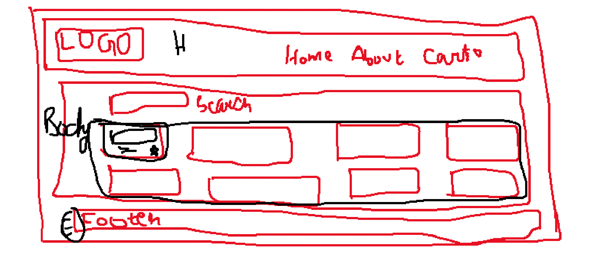
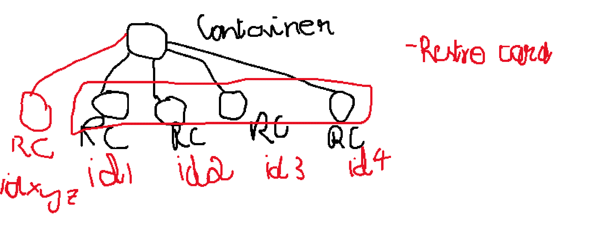

## Episode 4 - Talk is cheap show me the code

- Building the Swiggy like app
- First thing before building a food ordering app is planning.
- first step for planning is you should know what you're building
  1. UI
  2. Mock screen / Wireframes

   
  
## List of components we gonna build

 * Header
 *  - Logo
 *  - Nav Items
 * Body
 *  - Search
 *  - RestaurantContainer
 *     - RestaurantCard
 * Footer
 *  - Copyright
 *  - Links
 *  - Address
 *  - Contact


## App component
- it a function which returns a piece of JSX code.
- Whenever  you have a component that is reused always create a seperate component.

## Props (Shortform for properties)
- the properties are something that can be passed to the component.
- Props are normal arguments to the functions.
- Passing the prop to the component is passing the argument to the function.
- Props is just a javascript object you can write {props.resName}
- (Important) When you have to dynamically passin data to the component, you have to pass in as a prop.
- You can pass any number of prop

## Config driven UI (Jargon / keyword)
- All the UI is driven by the config
- ex: if you want to show red color background in delhi and bangalore green  just send the color in the url and your config will drive the UI.
- UI is powered by data .
- In react we have UI layer and data layer.

## ---------------------------------------------

## Note
1. In large applications you'll put all the images in cloudinary

## Map

- I'm doing a resList of map for each restro I'm rendering the RestaurantCard
  
- for each estro we've to return a restro card and I have to dynamically passen restrocard 

- built a reusable restro card component
- resList is an array it will loop over all the restro,for each estro we've to return a restro card
- pass the key resData
- In side my resContainer I have looped over my rest list and I'm doing a .map for each restro I'm returing a piece of jsx.
- it is a function returning a piece of jsx
- This is we render dynamic data over here.
- Whenever you're looping on to any list you have to give a key property you have to passin a unique id.
- each of the item should have a key.
## Note
1. Whenever you're doing a map or looping always you should give a key.

## Whenever you're doing a map or looping always you should give a key why?
- we need to uniquely identify the list item because if the new list item
came in in the first place with id xyz but its unique react will render one restro not all the restro.
- This is hugh optimization.
- React doesn't uniquely identify the element it will re render everything inside the res-container.

 
### _Syntax_
```sh
<div className="res-container">
resList.map((restaurant, index) => (
      <RestaurantCard key={index} resData = {restaurant} />
       ))}
       </div>
```

## Some ppl also uses indexes also for the key
- We can use index as a key.
- React itself says that dont use index as a key is bad practice
- Not using keys (not acceptable) --- index as key ---- uniue key(best practice)
- Index as key is last resolve

### _Syntax_
```sh
<div className="res-container">
resList.map((restaurant) => (
      <RestaurantCard key={restro.data.id} resData = {restaurant} />
       ))}
       </div>
```

## Summary
- We build a lot of components
- We passed in props
- What is key
- How we can pass in dynamic data
- What are key and props
- what are Functional components
- How we can render diffrent components
- Different ways to put css to components and UI
