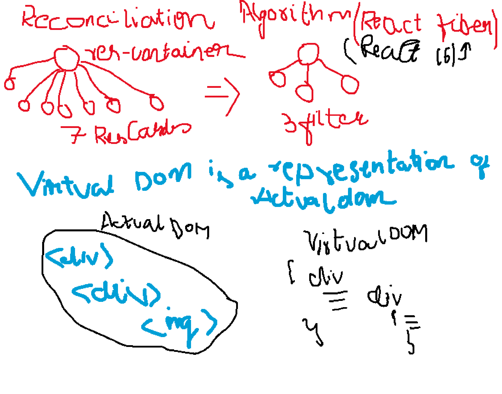

## Episode 5 - Lets get Hooked

## What is config driven UI
UI is driven by config sent by backed, How api was controlling our website

## Best Practices
- seperate files for separate components
- never keep hardcoded data in components
- Important to name all the URL's in the snake case
  const CDN_URL
- Component should not contain more than 100 lines, you can break into multiple components

## Two types of Export / Import
1. Default Export / Import
   - export default Component
   - import Component from "path"; 
   - module cannot have multiple default export
2. Named  
   - Suppose if you have to export multiple thing.
   write export infront of const
   - export const LOGO_URL = "http://hgsxhjagsxh"
   - import {Component} from "path";

## React Hooks
- state is a key word
- State Variable - Super powerful Variable -> keep the UI in sync with the data.
- React Hooks is a normal js utility function given by react that is prebuild
- Written by facebook developers
- Two important Hooks
  1.useState() - Superpowerfull react variable
    - import it as a named import
    - import {useState} from 'react';
  2.useEffect()

## Why react is Fast?
- Because react is effeciently doing DOM manipulation because of the Virtal DOM.
- It has a diff Algorithm which do efficient dom manipulation
it can find out the div and update the ui is the most core part of react this is what a core react algorithm is built upon 

- React is constantly keeping an eye on the useState variable when it updates it will find out the div and update the dom i,e it calls up the reconcilation algorithm

- When you call a second function setData react will automatically rerender the UI

- React is only good at dom manipulations
-  React does not touch the HTML (DOM) that is why react is fast
- React is the most popular UI library in the market

## React virtual dom 

- We see html tags all that its like a JS representation of it
- HTML code object representation of it

- Is the normal react/js object
- That we created in the first class which receives 3 arguments
 React.createElement("h1", {}) => React Element (object) it is the react virtual dom, simillarly if u have big structure its all an object <Body />
- Represtation of the actual dom
   

## Diff Algorithm
Which updates the diffrences between the updated virtual dom and previous virtual dom.
- It will calculate the difference and actually update the dom on every render cycle

## React fiber Algorithm
- It is the ongoing representation of react core algorithm
- It comes from React 16
- Its a new way of updating the dom
  ## Incremental Rendereing
   -Ability to split the rendering into several chunks over multiple frames


  ## Render
  - Whenever state variable updates nges react will rerender my component

## How to import named export
- With curly brackets
- import {LOGO_URL} from "../../utils.contants";   
- For default export dont use the curly brackets

##  Event Handlers
- In the button pass an attribute and attribute is known as onClick that takes a callback function that is arrow function
- onclick is an attribute receive

## Note
- UI layer will display what is being sent by data layer
- React is fast, efficeient in DOM manipulations
- UI and data layers has to work effeciently.
- Suppose if you want to keet your data and UI layer consistent or tied to each other that is where react come in picture.
- All these frameworks react, angular working to solve this i.e UI and data layer has to work in sync. if data layer changes UI changes update according to data.

### _Syntax_
```sh
   <button className="filter-btn" 
        onClick={() =>{
console.log("Button clicked)
        }}
        >
        Top Rated Restaurant
        </button>
```

## Food Ordering APP
 * Header
 *  - Logo
 *  - Nav Items
 * Body
 *  - Search
 *  - RestaurantContainer
 *     - RestaurantCard
 *       - Images
 *       - Name of Res, Star Rating , cuisine, delivery time
 * Footer
 *  - Copyright
 *  - Links
 *  - Address
 *  - Contact


## Summary
- Hooks - normal js utility functions
- First hook - Usestate - gives us access to super powerfull state variables inside react

- why are superpowersfull variable coz react is keeping an eye on it tract on it whenever these variable update the react will trigger a div algorithm it will find out the diff blw virtual dom it automagically updates the ui.

it keep the ui and data layer in sync that why react is fast


